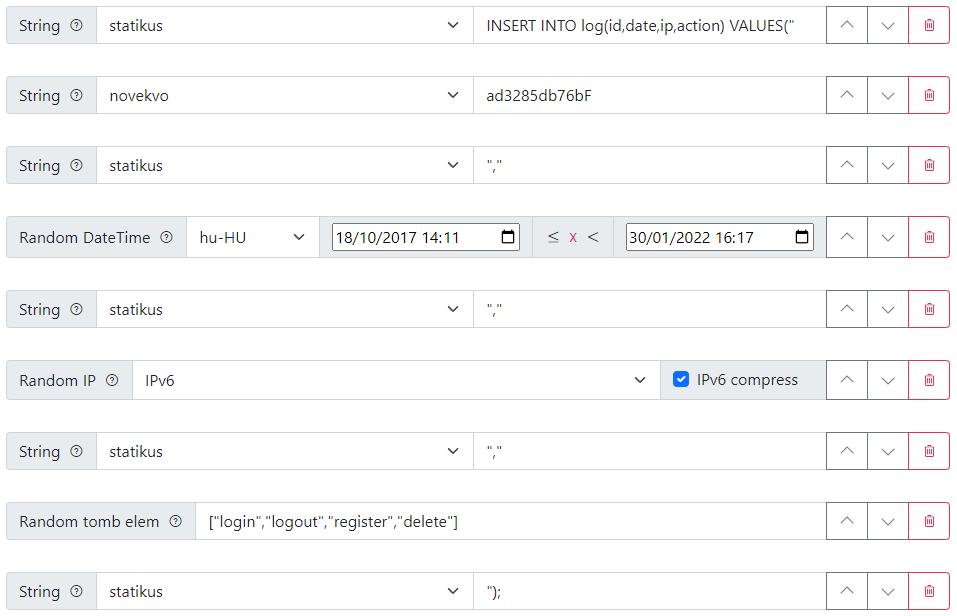

# IntelliKeri
Talán akkor lehet haszna, ha egy programot tobbféle hasonló input-al kéne tesztelni, vagy egy adatbázist kell random adattal feltolteni. A kód fele hulladék és újra kéne írni, meg néha logikátlanok a dolgok, de mukodik..

## Használat
- Az index.html megnyitása valami bongészovel (ami nem az IE).
- Bal fent a zold gombbal lehet új elemeket hozzáadni a listához.
- Az bekerul a listába, és lehet konfigurálni (hossz, tartomány, típus, stb).
  - Ez a lista a sorokhoz a sablon.
  - Az egymás alatti elemek egymás mellé rakva fognak egy sort alkotni, kozottuk egy opcionális elválasztóval.
  - Az elemek jobb szélén lehet torolni és fel-le mozgatni oket (sorrend változtatás).
  - A bal szélukon pedig a `?` ikonra kattintva elojon egy rovid leírás.
- Jobb fent a kék nyíllal lehet generálni és letolteni a fájlt (nem veszik el semmi).
  - Alapból `source.csv` a neve, `100` sorból áll, és `;` az elválasztó az elemek kozott.
  - Ez változtatható jobb fent a szurke gombbal.

## Példa (SQL INSERT INTO)

| Fájlnév  | Elválasztó | Sorok száma |
|----------|------------|-------------|
| logs.sql |            | 12          |


Eredmény `logs.sql`
```sql
INSERT INTO log(id,date,ip,action) VALUES("ad3285db7504","2019. 03. 22. 9:19:12","15d5:3fb3:90e8:2c98:6d04:d3e8:7329:e970","register");
INSERT INTO log(id,date,ip,action) VALUES("ad3285db7505","2020. 09. 05. 23:37:33","5166:32ee:9664:b5ae:efeb:7aaf:632d:93d0","delete");
INSERT INTO log(id,date,ip,action) VALUES("ad3285db7506","2019. 06. 01. 20:22:20","70f5:2fe9:e38b:2a90:c3c2:7729:169a:dd4c","register");
INSERT INTO log(id,date,ip,action) VALUES("ad3285db7507","2021. 11. 21. 15:02:51","3a27:1421:da50:2345:bd93:92e1:48be:fa1f","logout");
INSERT INTO log(id,date,ip,action) VALUES("ad3285db7508","2020. 08. 01. 7:36:35","98e5:ce8d:e9d2:3b95:14fa:e558:188c:5d49","logout");
INSERT INTO log(id,date,ip,action) VALUES("ad3285db7509","2017. 12. 13. 4:08:07","444e:c2f4:2846:6b14:fe2f:81bd:bc87:f662","login");
INSERT INTO log(id,date,ip,action) VALUES("ad3285db7500","2021. 08. 11. 15:11:28","e695:d13d:f315:467f:4cb0:6e77:6314:d2b6","logout");
INSERT INTO log(id,date,ip,action) VALUES("ad3285db76aa","2019. 05. 02. 16:00:43","4dd5:15c6:8a88:b707:f833:4f7c:eee2:e9e3","delete");
INSERT INTO log(id,date,ip,action) VALUES("ad3285db76ab","2018. 05. 02. 18:48:44","5bd8:ec0d:e9fd:f91f:e4a0:74e0:80dd:28a5","login");
INSERT INTO log(id,date,ip,action) VALUES("ad3285db76ac","2018. 03. 12. 17:07:40","b74:9661:e7af:3afa:af96:4e6f:5e89:f0e","register");
INSERT INTO log(id,date,ip,action) VALUES("ad3285db76ad","2018. 02. 16. 21:34:45","d62c:2a94:83ab:97d9:6f80:d818:298c:b38a","login");
INSERT INTO log(id,date,ip,action) VALUES("ad3285db76ae","2018. 08. 16. 22:09:32","fde1:5b74:9924:f37:749a:bd25:b760:145d","login");
```

## Debug
Néhány console-on futtatható kód. `debug.js`
```js
// Az osszes elem betoltése a listába
Debug.loadAll();
// Hibás input, 10 random email
Debug.emailGenUnexpected(10);
// Jó input, 10 random email
Debug.emailGenExpected(10);
// Hibás input, 10 random név
Debug.nameGenUnexpected(10);
// Jó input, 10 random név
Debug.nameGenExpected(10);
// String increment unit test
Debug.unitTestStringIncrement();
// Ismételt string increment
Debug.MultiIncrementString(10,'abcd',true);
```